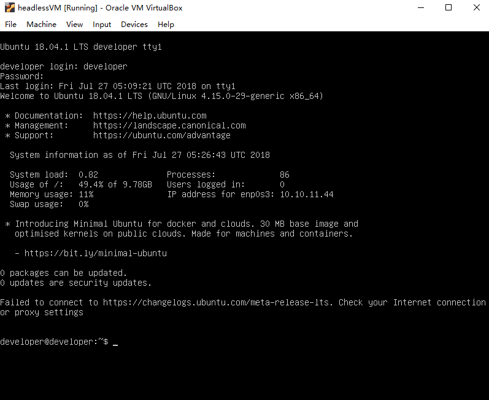
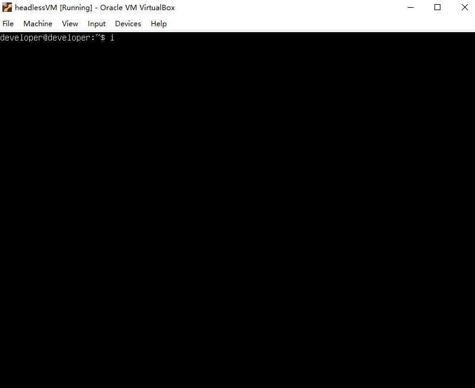
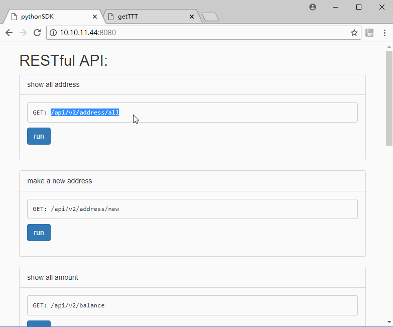
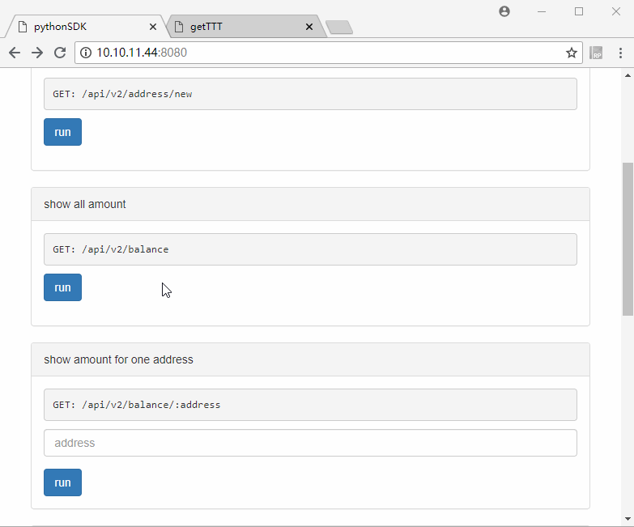
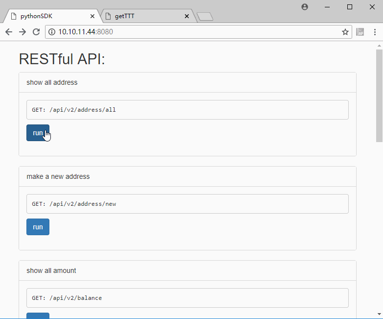
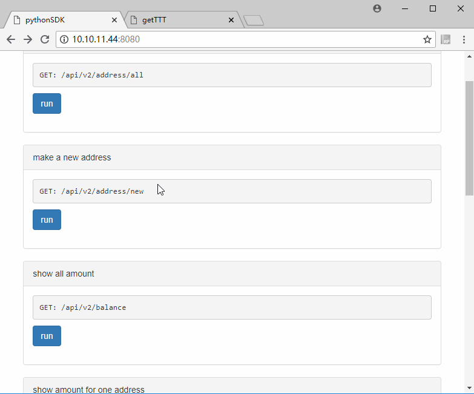

# developerVM 使用方法

下载：

[http://developers.trustnote.org/download/headlessVM.rar](http://developers.trustnote.org/download/headlessVM.rar)

1、导入headlessVM

首先解压缩headlessVM，然后打开VirtualBox，在菜单中选择File -> import Appliance


导入以后，点击headlessVM，再Show，这样就启动了虚拟机。


2、登陆虚拟机

账号和密码都是developer


3、启动RPC服务

登陆后直接进入RPC目录，启动RPC服务。

```
cd RPC

npm run start_rpc
```




4、启动RESTful API

其实到了第三步的时候，就已经可以用shell命令去调用RPC完成新建地址、转账、查询等功能了。但是，为了更方便让开发者使用，我们提供了更友好的pythonSDK，并且提供了一个web界面方便开发者知道如何调用及及时看到调用结果。

我们现在只需要：

```
cd pythonSDK

python3 web.py
```



然后，你就可以在浏览器里访问虚拟机的ip，记住，端口号是8080。
如果你不知道你虚拟机的ip，可以输入ifconfig命令来查看

这样，打开虚拟机的ip:8080 就可以开始调试了。


5、创建地址




6、查看总余额



显然，我们新部署的节点，是没有余额的。


7、领测试币和查询余额

我们找到headlessRPC里的地址，去http://dev.trustnote.org/getTTT 领测试币，就可以看到余额了。




8、转账

领币后，headlessRPC中就已经有余额了，之后我们向一个新建的地址里打入70个note，可以看到，这个交易速度是非常快的，几乎是秒到账的。



pythonSDK配合headlessRPC的使用就简单介绍到这里，通过这几个常用功能的组合，就可以开发出很多应用了。


<video controls="" autoplay="" name="media"><source src="http://developers.trustnote.org/videos/light.mp4" type="video/mp4"></video>
